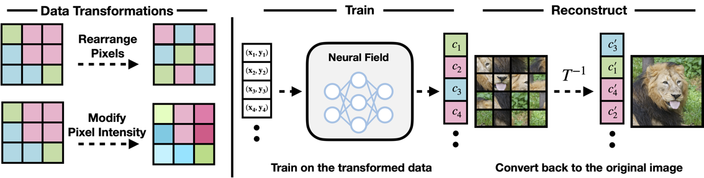
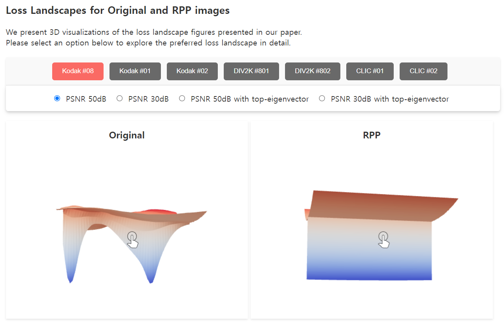

# In Search of a Data Transformation That Accelerates Neural Field Training
### [Paper](https://arxiv.org/abs/2311.17094) | [Hugging Face](https://huggingface.co/papers/2311.17094)

Junwon Seo\*, Sangyoon Lee\*, Kwang In Kim, Jaeho Lee<br><br>
Pohang University of Science and Technology (POSTECH)



<br>

This is the official Github page for the paper "In Search of a Data Transformation That Accelerates Neural Field Training" (CVPR 2023).

<br>

## SIREN experiments

Our experiments on SIREN are based on the official code for the paper ["Implicit Neural Representations with Periodic Activation Functions"](https://github.com/vsitzmann/siren).<br>

This repository does not contain any image datasets used in the manuscript.<br>
We used Kodak, DIV2K, and CLIC datasets for our main experiments. (Section 3.1. in our paper for details)
<br>

### Setup

To run a single SIREN experiment, execute the following command:

```
$ cd SIREN
$ python siren_DT.py --experiment_name= --lr= --sidelength= --num_workers= --project= \
--max_steps= --directory= --batch_size= --gpu_num= --type=
```
<br>

To run all experiments for the Kodak datset, use the following script:

```
$ cd SIREN
$ sh run_siren.sh
```
<br>

Description of the command line flags: <br><br>

* `experiment_name` (e.g., 1)
    * Specifies the number of the image for the experiment.
* `lr` (e.g., -10)
    * Learning rate with 2<sup>lr</sup>.
    * We used a range {2<sup>-8</sup>,...,2<sup>-16</sup>} in our manuscript.
* `sidelength` (e.g., 512)
    * Sidelength of the image.
    * All images used in the experiments were uniformly sized at 512*512.
* `num_workers` (e.g., 16)
* `project` (e.g., SIREN)
    * Name of your Weights&Biases project.
    * Learning curves can be easily found with Weights&Biases.
* `max_steps` (e.g., 10000)
* `directory` (e.g., kodak_ori)
    * Name of the directory for the image dataset.
    * Modify our code according to the name of your path and files.
* `batch_size` (e.g., 18)
    * Full batch for the 512*512 image.
* `gpu_num` (e.g., 0)
* `type` (e.g., origin)
    * Type of data transformation for the experiment.
    * Other data transformations can be found in our Python code.

<br>

### Loss Landscape

All loss landscapes in our paper can be visualized in the [Demo](https://huggingface.co/spaces/lyunm1206/Interactive_Loss_Landscapes) with 3D interactive versions.<br>
<br>
